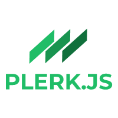

Bienvenid@ al repositorio de [Awesome profile-cards](http://beta.adalab.es/easley-s3-plerk.js/), una web donde podrás crearte una tarjeta de visita personalizada y compartirla en Twitter.

Esta fantástica herramienta está programada con React y está desarrollada por el grupo PLERK.JS

# Cómo usar este repositorio

Este proyecto está creado con [Create React App](https://github.com/facebook/create-react-app).

## Scripts disponibles en el proyecto:

- ### `npm start`

    Ejecuta la app en modo desarrollo. 
    Abre [http://localhost:3000](http://localhost:3000) para verlo en el navegador.

    La página se recargará si efectúas cambios. 
    Además verás los errores lint en la consola.

- ### `npm start`

    Ejecuta la app en modo desarrollo. 
    Abre [http://localhost:3000](http://localhost:3000) para verlo en el navegador.
    La página se recargará si efectúas cambios. 
    Además verás los errores lint en la consola.

- ### `npm test`

    Lanza el test runner en el modo interactivo watch. 
    Ve una sección sobre ello [running tests](https://facebook.github.io/create-react-app/docs/running-tests) para más información.

- ### `npm run build`

    Crea la app para producción en la carpeta `build`.

    ¡Tu app está lista para ser desplegada!

    Ve una sección en detalle sobre [despliegues](https://facebook.github.io/create-react-app/docs/deployment) para más información.

    * Si `npm run build` falla al minificar: https://facebook.github.io/create-react-app/docs/troubleshooting#npm-run-build-fails-to-minify

>## +Info de React
>
>- Puedes aprender más en [Create React App documentation](https://facebook.github.io/create-react-app/docs/getting-started).
>- Para aprender React, echa un vistazo a la [documentación de React](https://reactjs.org/).
>

 

